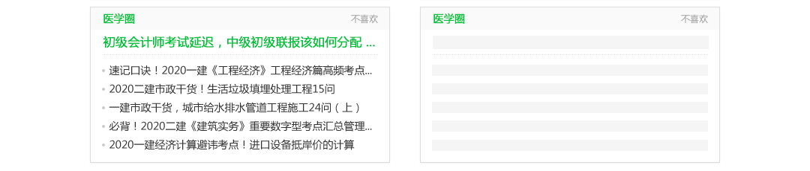

# 标准资讯 cube 模板，1主文字资讯 + 5文字资讯

## 介绍
标准资讯类模板，适合新闻资讯类场景（无展开样式）。

## 使用
```
cubetool init <cubeid> -t https://github.com/ntt360/cube-tpl-news-1headtext5text.git
```
或简写：
```
cubetool init <cubeid> -t ntt360/cube-tpl-news-1headtext5text
```

## UI预览


## data格式
```json
{
  "big_title": {
    "article_id": "KtjZPhS3MHv3Pw",
    "title": "2020助理执业中医师资格考试报考条件",
    "url": "https://news.edu.360.cn/article/detail/KtjZPhS3MHv3Pw"
  },
  "small_title": [
    {
      "article_id": "MdTZPhS2NHS5Ow",
      "title": "执业药师重点药：黄芩的功效与性能特点！",
      "url": "https://news.edu.360.cn/article/detail/MdTZPhS2NHS5Ow"
    },
    {
      "article_id": "KAfaQBS1MHC6PD",
      "title": "2020儿科中级职称考试报名时间",
      "url": "https://news.edu.360.cn/article/detail/KAfaQBS1MHC6PD"
    },
    {
      "article_id": "KAHdPhS0L3z4Pj",
      "title": "复杂的中医病名该怎么理解？如何对应西医病名",
      "url": "https://news.edu.360.cn/article/detail/KAHdPhS0L3z4Pj"
    },
    {
      "article_id": "KtbUPxS0L3vBOw",
      "title": "2020执业药师报考科目+报考费用+报考入口！",
      "url": "https://news.edu.360.cn/article/detail/KtbUPxS0L3vBOw"
    },
    {
      "article_id": "MdPXRBSzNXW8Pj",
      "title": "中医药的战“疫”力量！高等中医药教育的前世今生",
      "url": "https://news.edu.360.cn/article/detail/MdPXRBSzNXW8Pj"
    }
  ]
}
```